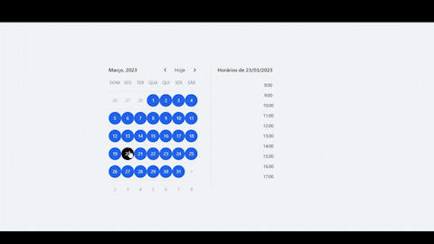

<h1> Como funciona? </h1>

<h4>
Basicamente, o cliente terá acesso a um calendário com horários pré-determinados pelo prestador de serviço,
(nesse caso seria o barbeiro) podendo escolher qual horário deseja marcar e sendo redirecionado para uma tela de login. 
Caso o usuário seja um novo cliente ou ainda não tenha feito login, terá a opção de se cadastrar. 
</h4>

<h2> Tecnologias usadas: </h2>
    <h3>Front-End</h3>
    <h4> 
      

       
       JavaScript
       
       React
       
       Tailwind CSS
       

   </h4>
   <h3>Back-End</h3>
    <h4> 
      

       
       Java
       
       Spring Boot
       
       MySQL Database
       

   </h4>

    <h2 align="center">
        UML
        <a href="https://github.com/uKRUGER11/-barbershop_appointment_spring/blob/master/imgs/entity_model.png">📥</a>
    </h2>
    <h3> Destrinchando a estrutura: </h3>

 

🔹 `HairCut`: Classe que representa o horário selecionado pelo cliente no calendário, pois quando é marcado um horário consequentemente será para um corte de           cabelo, assim dando sentido ao `- appointment: Instant`
- `1..*`: Expressão utilizada para demonstrar uma 'dependência' ou associação entre as classes, que neste caso trata-se de que um `Client` pode ter **1 ou mais** 
`- haircuts`. 

🔹 `Client`: Classe que representa o cliente em si com os seus dados armazenados, que serão usados para efetuarem seu login, ou se não possuirem, poderão fazer seu cadastro para consequentemente armazena-lós.
- `1`: Expressão utilizada neste caso para demonstar de que um `HairCut` pode ter **1 só** `- client`. 

> Porém como é possível um `HairCut` possuir **1 só** `Client`? Sendo que na classe `HairCut` existe uma associação **1 ou mais**? É a partir desse ponto onde outra classe entra... 

🔹 `Kids`: Classe que pode representar o(s) filho(s) ou filha(s) do `Client`. Neste caso, não se trata apenas de uma associação, mas sim de uma dependência com a classe 'Pai', assim os dados dos filhos serão iguais aos do `Client`, exceto o seu `- nameKid : String`, deixando notável a dependência logo nos próprios atributos, assim recebendo o mesmo número e senha da outra classe.
- `0..1`: Expressão utilizada neste caso para demonstar de que um `Client` pode ter **0, 1 ou mais** `- children`. 
- `1`: E que `Kids` deve ter **1** `- parent`.

> Isso faz com que `Client` e `Kids` possam ocupar mais de um horário, porém não podem ocupar mais de um 'espaço' no banco de dados, assim deixando a classe `Client` ser uma  **1 só**, podendo **ter ou não** um `- children`.

